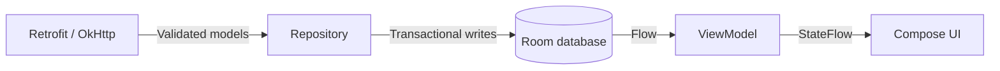

# Relatives

[](https://github.com/besklar/relatives/actions/workflows/android-ci.yml)

Native Android person browser for the FamilySearch take-home exercise. Built with Kotlin, Jetpack Compose and durable offline storage.

## Assignment coverage

| Requirement | Implementation |
| --- | --- |
| People list | Scrollable cards with portrait, full name, lifespan and birthplace. |
| Own model types | Typed HTTP DTOs mapped to domain models; UI never reads raw JSON. |
| Complete profile | Larger portrait, birth/death details, occupation, biography and relatives. |
| Family navigation | Relative cards open profiles by ID; Back preserves the browsing stack. |
| Offline after force-quit | Saved list, opened profiles and downloaded portraits survive process death. |
| Queryable persistence | Room schema, transactions, migrations and primary-key profile lookup. |
| Loading and failure states | Separate loading/empty/error states, Retry, and saved content during failed refreshes. |

**Extras:** lavender light/dark themes, relative portraits, shared portrait transitions, and a fullscreen viewer with pinch zoom, panning, X and Android Back.

## Build and run

### Toolchain

| Tool | Version used |
| --- | --- |
| Android Studio | Quail 4, 2026.1.4 Patch 1 |
| Build JDK | 21.0.11; explicitly select JDK 21 as the Gradle JVM |
| Gradle / Android Gradle Plugin | 8.13 / 8.12.0 |
| Kotlin / JVM target | 2.2.10 / 17 |
| Android SDK | Compile/target 36; minimum device API 26 |

1. Open the repository in Android Studio, select **JDK 21**, and sync Gradle.
2. Start an emulator or connect a phone.
3. Run the **app** configuration.

For terminal builds, set `JAVA_HOME` to your JDK 21 installation and `ANDROID_HOME` to your Android SDK directory:

```shell
./gradlew assembleDebug
"$ANDROID_HOME/platform-tools/adb" install -r app/build/outputs/apk/debug/app-debug.apk
"$ANDROID_HOME/platform-tools/adb" shell am start -n com.besklar.relatives/.MainActivity
```

- The Gradle wrapper is committed; no API keys or source edits are required.
- Android Studio can generate an ignored `local.properties`; terminal builds use `ANDROID_HOME`.
- The service is `https://fs-records-sample.vercel.app/` and requires no authentication.

## Architecture and decisions

### Unidirectional data flow



- **Refresh actions:** UI → ViewModel → repository → service. Results enter Room before appearing in the UI.
- **Native Kotlin/Compose:** fits the Android role and provides standard UI, lifecycle and gesture tools.
- **One module, manual DI:** an application container shares the client, repository, database and portrait store without a DI framework.
- **Entry-owned ViewModels:** typed ID routes support A → B → A; Back retains earlier screens and cancels popped entries' work.
- **Cancellation:** network/decode/storage work runs off the main thread. One cancellable mutex serializes refreshes; networking finishes before database transactions begin.

### Persistence and offline behavior

- **Four Room tables:** list metadata, ordered summaries, complete profiles and ordered relatives. Exported schemas and a tested, non-destructive 1→2 migration are committed.
- **Primary-key lookup:** fetch one saved profile by ID without reading every profile into memory.
- **Independent snapshots:** duplicate summary/profile fields intentionally so list refreshes cannot overwrite older profile details or delete opened profiles.
- **Explicit empty state:** list metadata distinguishes a successful empty response from a list that has never loaded.
- **Offline boundary:** a loaded summary does not imply a loaded full profile. Unopened profiles explain that no saved profile is available.
- **At 100,000 people:** first add server pagination, then Paging 3, indexed queries, incremental imports and bounded image storage. The current service returns all 16 people at once.

### Malformed records

| Response condition | Behavior |
| --- | --- |
| Bad person or duplicate ID | Skip/count it; retain other valid people. First valid duplicate wins. |
| Empty people array | Save a successful empty list. |
| Invalid envelope or nonempty all-invalid list | Fail refresh; preserve the previous saved list. |
| Invalid profile core or mismatched ID | Preserve the previous profile. |
| Bad or duplicate relative links | Skip/count them; retain the valid profile core. |

- Unknown JSON fields are ignored; server counts are informational.
- Display dates such as “about 1838” stay unchanged; integer years are stored separately.
- Living people have no invented death event. Missing occupation/biography shows **Not recorded**.
- Unknown relationship labels are preserved. Sources are ignored because their display was not requested.

### Portraits and viewing

- **Durable files:** service paths resolve to SHA-256 filenames in app-private `filesDir/portraits`; disk is checked before the network.
- **Safe completion:** same-origin downloads use temporary files, an 8 MB limit, image validation and rename after completion. Failure/cancellation cleans up temporary files.
- **Memory reuse:** an 8 MB bitmap LRU avoids portrait blanking during navigation; eviction never recycles images still held by screens.
- **Relative photos:** Room joins prefer a saved profile path, then its summary path. Unknown images use placeholders; no extra profile prefetch.
- **Transitions:** approximately 300 ms; keys identify the source entry/row. A display-only identity preview stays visible during loading/failure and never becomes a saved profile. Shared-transition API opt-in is isolated to navigation; system animation scale is respected.
- **Fullscreen:** show the complete image, pinch 1×–4×, and pan within image bounds. X/Back closes only the viewer. Rotation resets zoom; larger decoding is capped at 2048 pixels and reuses saved files offline.

## Tests and verification

```shell
./gradlew testDebugUnitTest connectedDebugAndroidTest lintDebug assembleDebug
```

A running emulator or connected device is required for instrumentation.

**CI:** GitHub Actions runs JVM tests, lint and the APK build on pull requests and pushes to `main`, using JDK 21. The badge reflects the latest main run; each run summarizes actual JVM test counts and saves test/lint reports for seven days. Android instrumentation tests run locally on an emulator or device.

- **Automated results:** **34 JVM + 38 Android tests pass** on API 36; `assembleDebug` and `lintDebug` pass. Lint reports zero errors and 19 unsuppressed tool/dependency/backup warnings.
- **Tests earn their keep at failure boundaries:** HTTP decoding, partial-record recovery, SQLite rollback/migration/reopen, cancellation, image corruption/limits/cache reuse, ViewModel states, navigation, rendered transition midpoints and fullscreen gestures.
- **Live offline check:** load all 16 people and browse Hannah → Bartholomew → Amos; force-stop, enable airplane mode, disable Wi-Fi, and repeat the journey. Saved text and portraits remain available. An unopened relative shows an explicit uncached failure.
- **Fullscreen live checks:** saved portrait in airplane mode, X/Back dismissal, rotation with the viewer open and 150% text. Screenshots inspected; pinch and pan verified by multi-touch instrumentation.
- **Other live checks:** first-launch offline, light/dark appearance, 150% text, landscape, Android Back, repeated taps and disabled animations. Emulator settings restored afterward.
- **Clean checkout:** the base revision built and ran from a fresh clone with `ANDROID_HOME`, no `local.properties`, and no private planning files.
- **Test transport:** debug builds allow HTTP only to localhost/127.0.0.1 for MockWebServer; the records service uses HTTPS.

## Dependencies

| Package(s) | Why included |
| --- | --- |
| Activity Compose 1.10.1 | Android activity host and edge-to-edge layout. |
| Compose UI, Animation, Material 3; BOM 2025.08.01 | Declarative screens, gestures, shared transitions and standard components. |
| Lifecycle runtime-compose / viewmodel-compose 2.9.2 | Lifecycle-aware collection and screen state ownership. |
| Navigation Compose 2.9.3 | Typed routes, entry state and Back handling. |
| Room runtime / ktx / compiler 2.7.2; KSP 2.2.10-2.0.2 | Queryable storage, transactions, observable queries and generated DAOs. |
| Retrofit / serialization converter 3.0.0; serialization JSON 1.9.0 | Typed HTTP transport and DTO decoding. |
| Coroutines Android 1.10.2 | Cancellable asynchronous work, flows and mutexes. |
| OkHttp 5.1.0 | Shared transport, timeouts and streamed portraits. |
| AGP 8.12.0; Kotlin Android / Compose / serialization plugins 2.2.10 | Android packaging and generated Kotlin/Compose/serialization code. |
| JUnit 4.13.2; coroutines-test 1.10.2; MockWebServer 5.1.0 | Assertions, controlled coroutine scheduling and deterministic HTTP failures. |
| AndroidX Test core / runner 1.7.0; extension JUnit 1.3.0 | Instrumentation against Android SQLite, images and input. |
| Room testing 2.7.2 | Validate migrations against exported schemas. |
| Compose UI test JUnit / debug test manifest; Compose BOM | Screen, gesture and navigation tests. |

## Known gaps and another day

### Current tradeoffs

- Record and portrait saves are separate: text can be available while an image remains a placeholder.
- Saved image URLs have no automatic revalidation or disk eviction; app data removal clears them.
- Refresh runs on screen creation or request; no background sync or server pagination.
- No search, family tree, source viewer, analytics or release signing.
- Verification used API 36; a physical device, API 26 and a full TalkBack walkthrough remain untested.

### With another day

1. Broaden accessibility, device and text-size testing.
2. Add bounded portrait retention and image revalidation/versioning.
3. For a larger service, add pagination/Paging 3 and per-resource refresh coordination.

## Time and development assistance

- **Measured implementation/verification:** Approximately 78 minutes across seven phases, including about 13 minutes for the fullscreen viewer and README cleanup.
- **Total elapsed project time:** approximately 2 hours 24 minutes, from about 6:00 p.m. to 8:24 p.m. on October 8, 2026 (America/Denver), including planning and review pauses. The first commit was at 6:08 p.m.
- AI-assisted development was used for implementation support, test generation, and documentation. Architecture, product behavior, security decisions, and final verification remain subject to human review.
